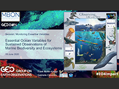

<a href="FMK_GC_GEO-2020-Presentation_June 8.pdf" target="_blank"> 
Essential Ocean Variables for Sustained Observations of Marine Biodiversity and Ecosystems</a> 
Gabrielle Canonico, Frank Muller-Karger (<a href="https://www.youtube.com/embed/V-wLqk2ln1U" target="_blank">Watch video here</a>)

