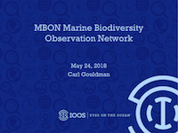
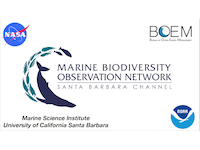
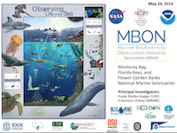
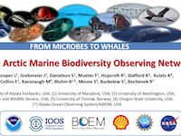
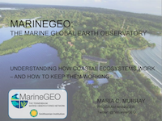
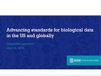
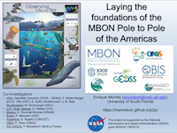
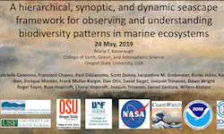
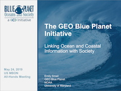
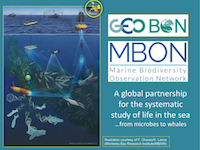

<a href="0845_gouldman_MBON%20mtg%20MAY_2019_gouldman-converted-compressed.pdf" target="_blank"> 
Kickoff and Welcome</a> 
Carl Gouldman

<a href="0930_miller_NASA_April_2019-converted-compressed.pdf" target="_blank"> 
Status - Santa Barbara Channel MBON</a> 
Bob Miller

&nbsp;

<a href="1000_mueller-kargerSanctuaries_MBON_FMK-2019_V1-converted-compressed.pdf" target="_blank"> 
Status - Sanctuaries MBON</a> 
Frank Muller-Karger

<a href="1030_mueter_All%20MBON%202019%20meeting%20FINAL%20AMBON-converted-compressed.pdf" target="_blank"> 
Status - Arctic MBON</a> 
Franz Meuter

&nbsp;

<a href="1130_Murray_MBON%20AllHands_190524p-converted-compressed.pdf" target="_blank"> 
Smithsonian-led MarineGEO</a> 
Maria Murray

<a href="1145_Woodward%20MBON%20All%20Hands%20Meeting%20May%2024%2C%20%202019-converted-compressed.pdf" target="_blank"> 
Animal Telemetry Network: Regional Priorities & Network Development</a> 
Bill Woodward

&nbsp;

<a href="1315_a_Canonico_Data%20standards%20presentation_MBON%20All%20Hands%202019-converted-compressed.pdf" target="_blank"> 
Advancing Standards for Biological Data in the US and Globally</a> 
Gabrielle Canonico

<a href="1330_b_Buckelew_obrien_MBON%20DM%20-%20overview%20-%20final-converted-compressed.pdf" target="_blank"> 
Pathways and Challenges for Data to the MBON Portal, OBIS, and Other Platforms</a> 
Stacey Buckelew/Margaret O'Brien

&nbsp;

<a href="1345_MontesMBON_P2P_MAY2019_day2_EM-converted-compressed.pdf" target="_blank"> 
MBON Pole to Pole</a> 
Enrique Montes

<a href="1400_Kavanaugh_NASA_BEF_2019_KAVANAUGH_GLOBEUPDATE-converted-compressed.pdf" target="_blank"> 
Global Seascapes</a> 
Maria Kavanaugh

&nbsp;

<a href="1415_Smail_May_2019_MBON_Blue_Planet-converted-compressed.pdf" target="_blank"> 
GEO Blue Planet</a> 
Emily Smail

<a href="1430_Muller-Karger_MBON_International_May2019-converted-compressed.pdf" target="_blank"> 
Linkages to the Inergovernmental Oceanographic Commission, Ocean Obs 19 and the UN Decade of Ocean Science for Sustainable Development (2021-2030)</a> 
Frank Muller-Karger

