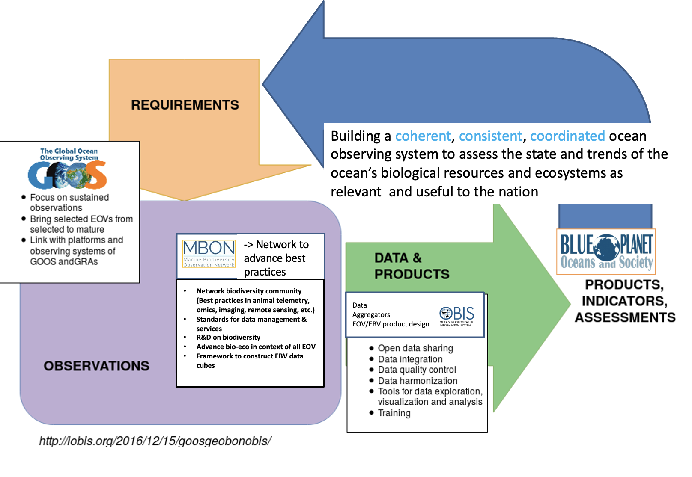

The Marine Biodiversity Observation Network (MBON) is a growing global initiative composed of regional networks of scientists, resource managers, and end-users working to integrate data from existing long-term programs to improve our understanding of changes and connections between marine biodiversity and ecosystem functions.

