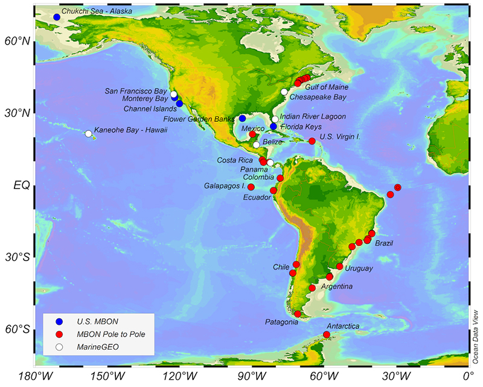

**News**
MBON Pole to Pole is on the web: MBON is developing a Community of Practice across the Americas to assess marine biodiversity and ecosystem change using field and space observations. You can follow MBON Pole to Pole progress [here](https://marinebon.org/p2p/index.html).

**Background**
In October 2017, NASA announced the winning projects for the ROSES A.50 Group on Earth Observations (GEO) Work Programme solicitation. The MBON Pole to Pole effort - “Laying the foundations of the Pole-to-Pole Marine Biodiversity Observation Network of the Americas” - was one of 32 funded programs.

 

MBON Pole to Pole seeks to facilitate the integration of biological and environmental data for countries along the Pacific and Atlantic coasts of the Americas, from the Arctic to Antarctica. Changes in marine biodiversity are being documented in these regions (Cruz et al., 2003; Escribano et al., 2003; Miloslavich et al., 2011; Taylor et al, 2012) but effective decision-making requires an detailed understanding of these changes. The Pole-to-Pole (P2P) MBON initiative was conceived as a network of cooperating research institutions, marine laboratories, parks, and reserves that seek to address common problems related to sustaining ecosystem services through conservation ecology.

The effort engages AmeriGEOSS member countries to collect biological measurements using common methodologies and to share knowledge on a continental scale. P2P MBON will supports groups in the American continent and small island developing states to: develop and document best practices associated with marine biodiversity observations, including methods for data collection and data management, while allowing flexibility to ensure national needs are addressed; enhance coordination of data collection within and between nations; integrate biodiversity data collection with physical and biogeochemical observations; and evaluate status and trends of marine biodiversity and ecosystems.

The project is led by Enrique Montes, University of South Florida (USF). Co-investigators include: Frank Muller-Karger (USF), Eduardo Klein (Universidad Simón Bolivar, Venezuela); Ben Best (EcoQuant), Maria Kavanaugh (Oregon State University), Daniel Otis (USF), Paul Seymour (NOAA AmeriGEOSS), Senai Habtes (University of the Virgin Islands), Elva Escobar-Briones (Universidad Nacional Autonoma de Mexico, Mexico), Antonio Marques (Universidade de Sao Paulo, Brazil), Iliana Chollett (Smithsonian Center for Marine Conservation), and Gregorio Bigatti (CONICET, Argentina).

MBON Pole to Pole is a voluntary effort and a partnership among independent monitoring and research programs, GOOS, OBIS, and GEO BON/MBON. The work is aligned with the objectives of the Intergovernmental Oceanographic Commission’s Global Ocean Observing System and the GEO Work Programme. USGEO Partners involved in the project include: National Aeronautics and Space Administration (NASA), National Oceanic and Atmospheric Administration (NOAA), U.S. Integrated Ocean Observing System (IOOS) and U.S. Geological Survey (USGS).
